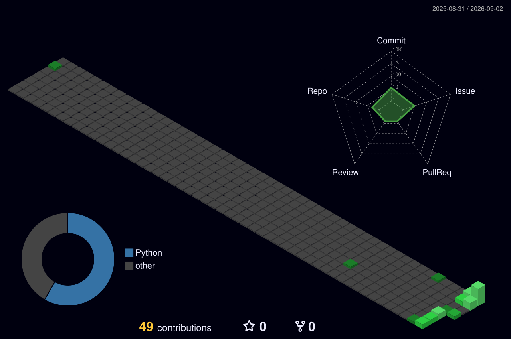

<div align="center">

# Hi, I'm Kushal 👋

### CS & Engineering student building software across AI, backend systems, real-time processing, and developer tools.

I learn by shipping — real projects, real bugs, real refactors.

<br/>


[](https://github.com/kushal98457-ctrl)

</div>

<br/>

## About Me

- 🎓 Computer Science & Engineering student
- 🛠️ Interested in **backend engineering, real-time systems, AI/RAG applications, and developer tooling**
- 🧠 Currently deepening my understanding of **system architecture, performance optimization, and applied machine learning**
- 🔍 Exploring **open-source contribution** — fixing issues, improving docs, refactoring, and submitting meaningful PRs
- 💬 I care about *why* something works, not just that it works — I try to understand systems, not just use frameworks
- ⚡ Fun fact: I'd rather rebuild something properly than patch it forever

<br/>

## 🚧 Currently

| | |
|---|---|
| 🏗️ **Building** | Real-time systems and backend services with a focus on clean architecture |
| 🧪 **Improving** | Existing projects (Bionic Reader) through iterative refactors, testing, and version upgrades |
| 🤖 **Exploring** | AI/RAG pipelines, prompt-engineering tooling, and applied ML for decision support |
| 🌱 **Learning** | Distributed/real-time architecture, and the fundamentals of blockchain & FinTech systems |
| 🤝 **Open to** | Open-source collaboration and code review on backend/AI-adjacent repos |

*Not all of the above are active at once — this is a rotating set of interests, not a permanent job description.*

<br/>

## 🧰 Tech Stack

**Actively used**

<p>


</p>

**Exploring / hands-on exposure**

<p>


</p>

<details>
<summary><b>Breakdown by category</b></summary>
<br/>

| Category | Technologies |
|---|---|
| **Languages** | Python, C, C++, JavaScript, HTML, CSS, Pine Script |
| **Backend & Systems** | FastAPI, WebSockets, REST APIs, Docker, Docker Compose, MongoDB, SQLite (exposure), Linux, Git |
| **AI / Data / CV** | OpenCV, NumPy, Machine Learning (Logistic Regression), RAG, OCR, PDF processing, Gemini/API-based integrations |
| **Frontend** | HTML5, CSS, JavaScript, HTML5 Canvas, React (exposure), Tailwind CSS (exposure) |
| **Other** | FFmpeg, GitHub, trading/financial tech concepts, blockchain/Web3 concepts |

</details>

<br/>

## 🏗️ Engineering Philosophy

```
Build → Test → Improve → Document
```

- Practical projects over tutorial-only projects
- Clean, modular architecture over quick hacks
- Performance and scalability considered from the start, not bolted on
- Documentation and testing as part of the build, not an afterthought
- Understanding systems > just using frameworks
- Iteration over one-shot builds — Bionic Reader is a good example: same core idea, several passes of refactoring, testing, and feature growth

<br/>

## 📊 GitHub Stats

<div align="center">


</div>

*Stats are generated live by third-party services (github-readme-stats / github-readme-streak-stats) — if a card fails to render on your fork, it usually means the service is temporarily rate-limited; it isn't fabricated data.*

<br/>

## 🌍 Open Source

I'm actively looking to contribute to real projects — not just star them. Interested in:

- Finding active, well-maintained repos in backend/AI-adjacent spaces
- Fixing issues and improving documentation
- Refactoring for clarity and performance
- Adding tests and small, well-scoped features
- Submitting PRs that are genuinely useful, not padding for a contribution graph

I don't have merged contributions to list yet — this is a stated direction I'm working toward, not a claim of a contribution history.

<br/>

## 🔭 Areas of Exploration

Not everything below is a finished product — some are experiments, some are in progress.

| Status | Area |
|---|---|
| 🧪 Exploring | AI notes summarizer, PDF/OCR pipelines |
| 🧪 Exploring | RAG systems, modular RAG architecture (RAGForge-style) |
| 🧪 Exploring | Device benchmarking using WebGPU |
| 🧪 Exploring | Procedural/game development (including an in-progress procedurally-generated detective mystery game) |
| 🧪 Exploring | Blockchain/Web3, trading tools, Pine Script strategies |
| 🧪 Exploring | Email validation tooling, data/bandwidth-sharing concepts |
| 🛠️ Built | Email/data-utility scripts and small developer tools |

**On FinTech & blockchain specifically:** this is genuine technical curiosity — market-data systems, transaction/settlement mechanics, trading infrastructure — not a claim of professional trading or financial expertise.

<br/>

## 📈 Learning Direction

```
Software Engineering
   → Backend Development
      → Systems & Performance
         → AI / ML
            → RAG
               → Real-Time Applications
                  → Blockchain / FinTech
                     → Open Source
```

Each stage builds on the last — I'm not chasing every technology at once, I'm moving through this progression one solid project at a time.

<br/>

## 📫 Connect

<p>
<a href="mailto:your.email@example.com"></a>
<a href="https://linkedin.com/in/your-linkedin"></a>
<a href="https://github.com/kushal98457-ctrl"></a>
</p>

*(will be connected shortly.)*

<br/>

---

<div align="center">


**Someone who learns by building.**

</div>
